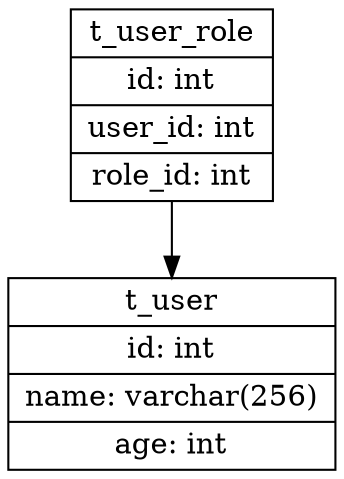

# 数据库表关系图

```graphviz
digraph demo {
    subgraph a {
        node [shape="record"]
        t_user [label="{t_user | id: int | name: varchar(256) | age: int }"]
    }

    subgraph b {
        node [shape="record"]
        t_user_role [label="{t_user_role| id: int | user_id: int | role_id: int }"]
    }

    t_user_role:user_id -> t_user:id
}
```
